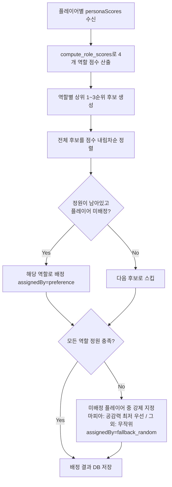
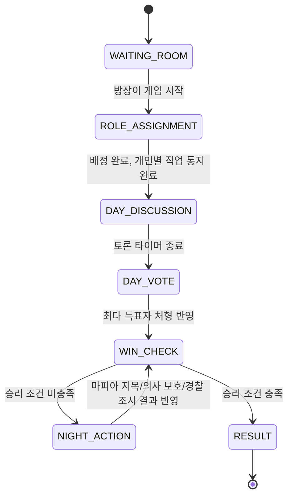

# 페르소나 기반 마피아 게임 — 상세 기획 및 설계 문서

> **문서 상태:** 개발 착수용 상세 설계안 (v1.0)
> **담당 범위:** 게임 로직 개발 + 외부 페르소나 성향 데이터의 직업 배정/게임 연동
> **전제:** 페르소나 성향 데이터 추출·분석은 별도 팀 담당. 본 문서는 "전달받은 성향 데이터를 어떻게 직업 배정 및 게임 진행에 적용하는가"에 집중한다.
> **인프라 정합성:** 상위 프로젝트(CrewVerse) 기술 스택인 `React + Vite` / `FastAPI` / `PostgreSQL` / `HTTP POST + Polling`을 그대로 따른다. Server가 게임 상태의 authoritative source이며, Frontend는 상태를 주기적으로 poll하여 연출만 담당한다.

---

## 1. 개요 (Overview)

### 1.1 컨셉

처음 만난 사람들이 아이스브레이킹을 위해 짧은 시간 플레이하는 웹/앱 기반 미니 마피아 게임이다. 일반적인 마피아 게임과 다른 핵심 차별점은 **직업 배정 방식**에 있다.

- 기존 마피아 게임: 직업은 완전 무작위 배정.
- 본 게임: 사전에 진행한 성향 설문에서 추출된 각 플레이어의 페르소나 성향 데이터를 바탕으로, "이 사람이 마피아/경찰/의사 역할에 얼마나 어울리는가"를 계산하여 **성향 기반으로 직업을 배정**한다.

### 1.2 목적

1. **게임 재미**: 무작위 배정보다 개연성 있는 배정으로 "왜 저 사람이 마피아였지?"라는 몰입감을 준다.
2. **아이스브레이킹 효과**: 게임 종료 후 각자의 성향과 직업 매칭 이유를 브리핑으로 보여줌으로써, 서로에 대한 대화 소재("나 원래 그런 사람 아닌데" "역시 분석력 높더라")를 자연스럽게 만든다.
3. **데이터 연속성**: 이 미니게임에서 생성된 상호작용(투표, 생존 여부, 지목 등)은 상위 프로젝트(CrewVerse)의 Social Seed로 재사용 가능하도록 구조화하여 기록한다.

### 1.3 스코프 경계

| 포함 | 제외 (타 팀 또는 후순위 담당) |
|---|---|
| 성향 데이터 → 직업 가중치 계산 알고리즘 | 성향 설문 문항 설계, 성향 점수 추출 로직 |
| 직업 배정(충돌 해결·예외 처리) 로직 | 페르소나 캐릭터 비주얼/아바타 생성 |
| 낮/밤 게임 진행 상태 머신 | AI 기반 자연어 브리핑 생성(있다면 P1 이후) |
| 게임 상태 DB 설계 | 로그인/계정/멀티 룸 운영 인프라 |
| 결과 화면 매칭 브리핑 로직 설계 | 최종 UI 비주얼 디자인 |

---

## 2. 입력 데이터 명세 (Data Interface)

### 2.1 전제

성향 데이터를 추출하는 팀의 실제 API 스펙은 아직 확정되지 않았으므로, 본 문서는 **작업 가능한 예시 스키마(working assumption)**를 정의한다. 실제 연동 전 해당 팀과 필드명·범위에 대한 계약(contract) 확인이 필요하다.

- 성향 지표는 **0~100 정수 점수** 형태로 전달된다고 가정한다.
- 최소 4개 지표를 기준으로 설계하되, 지표 추가는 가중치 테이블 확장만으로 대응 가능하도록 알고리즘을 설계한다(3장 참고).

### 2.2 예시 JSON

```json
{
  "roomId": "room_9f3c1a",
  "players": [
    {
      "playerId": "p_01",
      "nickname": "정글짐",
      "personaScores": {
        "initiative": 82,
        "analysis": 65,
        "empathy": 40,
        "caution": 55
      },
      "traitTags": ["직진형 리더", "위기에 강함"],
      "generatedAt": "2026-08-26T10:00:00Z"
    },
    {
      "playerId": "p_02",
      "nickname": "라이트",
      "personaScores": {
        "initiative": 35,
        "analysis": 90,
        "empathy": 58,
        "caution": 70
      },
      "traitTags": ["논리적", "신중한 관찰자"],
      "generatedAt": "2026-08-26T10:00:00Z"
    }
  ]
}
```

### 2.3 필드 정의

| 필드 | 타입 | 필수 | 설명 |
|---|---|---|---|
| `personaScores.initiative` | int (0~100) | Y | 주도성 — 상황을 이끌고 결정을 주도하는 성향 |
| `personaScores.analysis` | int (0~100) | Y | 분석력 — 정보를 논리적으로 추론/검증하는 성향 |
| `personaScores.empathy` | int (0~100) | Y | 공감력 — 타인의 감정과 신뢰를 중시하는 성향 |
| `personaScores.caution` | int (0~100) | Y | 신중함 — 발언·행동 전에 리스크를 재는 성향 |
| `traitTags` | string[] | N | 결과 브리핑 연출용 참고 텍스트. 가중치 계산에는 사용하지 않음 |

### 2.4 검증 규칙

- 4개 지표 중 하나라도 누락 시, 해당 지표는 **중립값 50**으로 대체하고 서버 로그에 경고를 남긴다(성향 팀 데이터 결손이 배정 자체를 막지 않도록).
- 점수 범위를 벗어난 값(음수, 100 초과)은 0~100으로 clamp한다.
- 이 검증은 배정 알고리즘 진입 전, 서버 단에서 1회 수행한다(3.2절 `computeRoleScores` 이전 단계).

---

## 3. 페르소나 - 직업 매핑 및 가중치 알고리즘

### 3.1 성향 지표별 직업 매칭 가이드라인

| 지표 | 마피아 | 경찰 | 의사 | 시민 |
|---|---|---|---|---|
| 주도성(initiative) ↑ | 가중치 ↑ (상황을 주도해 의심을 피함) | - | - | - |
| 분석력(analysis) ↑ | - | 가중치 ↑ (거짓 진술 추론) | - | - |
| 공감력(empathy) ↓ | 가중치 ↑ (낮을수록 거짓말에 대한 심리적 부담이 적음) | - | 가중치 ↑ (반대로 높을수록 보호 욕구가 강함) | - |
| 신중함(caution) ↑ | 가중치 ↑ (침착하게 정체를 숨김) | 가중치 ↑ (성급한 지목을 피함) | 가중치 ↑ (신중하게 보호 대상 선택) | - |
| (특화 점수 없음) | - | - | - | 기본값(fallback) 역할 |

### 3.2 가중치 계산 공식

역할별 계수는 하드코딩하지 않고 **설정 가능한 계수 테이블**로 관리한다(운영 중 튜닝 가능). 기본 제안값은 다음과 같다.

```python
DEFAULT_WEIGHTS = {
    "mafia":  {"initiative": 0.40, "empathy_inverse": 0.35, "caution": 0.25},
    "police": {"analysis": 0.60, "caution": 0.40},
    "doctor": {"empathy": 0.65, "caution": 0.35},
    # citizen은 특화 지표가 없는 기본(fallback) 역할이므로 고정 기준점을 사용한다.
    "citizen_baseline": 50,
}

def compute_role_scores(persona_scores: dict) -> dict:
    p = persona_scores
    return {
        "mafia": (
            DEFAULT_WEIGHTS["mafia"]["initiative"] * p["initiative"]
            + DEFAULT_WEIGHTS["mafia"]["empathy_inverse"] * (100 - p["empathy"])
            + DEFAULT_WEIGHTS["mafia"]["caution"] * p["caution"]
        ),
        "police": (
            DEFAULT_WEIGHTS["police"]["analysis"] * p["analysis"]
            + DEFAULT_WEIGHTS["police"]["caution"] * p["caution"]
        ),
        "doctor": (
            DEFAULT_WEIGHTS["doctor"]["empathy"] * p["empathy"]
            + DEFAULT_WEIGHTS["doctor"]["caution"] * p["caution"]
        ),
        "citizen": DEFAULT_WEIGHTS["citizen_baseline"],
    }
```

- 각 계수 그룹의 합은 1.0으로 정규화하여 0~100 범위의 점수가 유지되도록 한다.
- `citizen`은 특화 계산이 없는 잔여(fallback) 역할이므로 고정 기준점(50)을 부여한다. 다른 역할 점수가 모두 50 미만인 "평균적인" 플레이어일수록 시민이 상대적으로 상위 순위에 오르게 되는 효과를 의도한 설계다.
- 지표가 추가되는 경우, `DEFAULT_WEIGHTS`에 항목만 추가하면 되므로 이후 성향 팀이 지표를 확장해도 알고리즘 구조 변경이 필요 없다.

### 3.3 1~3순위 선호도 산출

```python
def rank_top3(role_scores: dict) -> list[tuple[str, float]]:
    return sorted(role_scores.items(), key=lambda kv: kv[1], reverse=True)[:3]
```

각 플레이어에 대해 위 함수를 실행하면 `[("mafia", 78.2), ("caution... 생략), ...]` 형태로 1~3순위 직업과 점수가 산출된다.

### 3.4 인원별 직업 정원

| 인원 | 마피아 | 경찰 | 의사 | 시민 |
|---|---|---|---|---|
| 4인 | 1 | 1 | 1 | 1 |
| 5인 | 1 | 1 | 1 | 2 |
| 6인 | 2 | 1 | 1 | 2 |

### 3.5 배정 알고리즘 (충돌 해결 포함)

**방식: 전역 그리디(Greedy Auction) 매칭.** 모든 플레이어의 1~3순위 (직업, 점수) 후보를 하나의 풀로 모은 뒤 점수 내림차순으로 정렬하여 순서대로 배정한다. 이렇게 하면 "1순위 우선 배치 → 정원 초과 시 2·3순위로 재배치"라는 요구사항이 별도 분기 로직 없이 자연스럽게 구현된다.

```python
def assign_roles(players: list[dict], role_capacity: dict) -> dict:
    """
    players: [{playerId, personaScores}, ...]
    role_capacity: 예) {"mafia": 2, "police": 1, "doctor": 1, "citizen": 2}
    반환: {playerId: {"role": str, "score": float, "assignedBy": str}}
    """
    candidates = []
    for player in players:
        scores = compute_role_scores(player["personaScores"])
        for rank, (role, score) in enumerate(rank_top3(scores), start=1):
            candidates.append({
                "playerId": player["playerId"],
                "role": role,
                "score": score,
                "rank": rank,  # 1~3순위, 동점 시 타이브레이커로 사용
            })

    # 점수 내림차순, 동점이면 선호순위(rank)가 높은(숫자가 작은) 쪽 우선
    candidates.sort(key=lambda c: (-c["score"], c["rank"]))

    remaining = dict(role_capacity)
    assigned = {}

    for c in candidates:
        if c["playerId"] in assigned:
            continue
        if remaining.get(c["role"], 0) <= 0:
            continue
        assigned[c["playerId"]] = {
            "role": c["role"],
            "score": c["score"],
            "assignedBy": "preference",
        }
        remaining[c["role"]] -= 1

    # 3.6절 예외(fallback) 처리로 이어짐
    assigned = fill_remaining_with_fallback(players, assigned, remaining)
    return assigned
```

### 3.6 예외 처리 (Fallback) — 정원 미달 시 강제 지정

그리디 배정이 끝난 뒤에도 특정 역할(특히 마피아)의 정원이 채워지지 않는 경우가 존재한다 — 예를 들어 6인 중 마피아를 1~3순위로 희망한 사람이 아무도 없거나, 희망자가 모두 다른 역할에 먼저 배정된 경우다. 이때는 **미배정 플레이어 중에서 강제 지정**한다.

```python
import random

def fill_remaining_with_fallback(players, assigned, remaining):
    unassigned = [p for p in players if p["playerId"] not in assigned]

    for role, count in list(remaining.items()):
        while count > 0 and unassigned:
            if role == "mafia":
                # 공감력이 가장 낮은 사람을 우선 선택(성향상 그나마 근접한 사람),
                # 동점이면 완전 무작위
                pick = min(
                    unassigned,
                    key=lambda p: (p["personaScores"]["empathy"], random.random()),
                )
            else:
                pick = random.choice(unassigned)

            role_score = compute_role_scores(pick["personaScores"])[role]
            assigned[pick["playerId"]] = {
                "role": role,
                "score": role_score,
                "assignedBy": "fallback_random",
            }
            unassigned.remove(pick)
            count -= 1
        remaining[role] = count

    return assigned
```

- `assignedBy` 필드(`"preference"` / `"fallback_random"`)는 DB에 그대로 저장한다. 6장의 결과 브리핑에서 "왜 이 직업이 되었는지" 문구를 다르게 생성하는 데 사용된다(성향 기반 배정 vs. 운명적 강제 배정).
- 마피아 fallback에만 "공감력 최저" 우선순위를 적용하는 이유는 요구사항이 명시한 "마피아 적합자 부재 시 강제 지정"에 최소한의 개연성을 부여하기 위함이다. 경찰/의사/시민 fallback은 완전 무작위로 충분하다(성향 요구사항에 명시되지 않음 + 과설계 방지).

### 3.7 처리 흐름 요약



---

## 4. 게임 진행 프로세스 (Game Flow & State Machine)

### 4.1 상태 정의

| 상태 | 설명 |
|---|---|
| `WAITING_ROOM` | 방 생성 후 인원(4~6명) 집합 대기 |
| `ROLE_ASSIGNMENT` | 3장 알고리즘 실행, 각 플레이어에게 비공개로 직업 안내 |
| `DAY_DISCUSSION` | 낮 토론 타이머 진행 |
| `DAY_VOTE` | 토론 종료 후 지목 투표, 최다 득표자 처형 |
| `NIGHT_ACTION` | 마피아 지목 / 경찰 조사 / 의사 보호 동시 접수 |
| `WIN_CHECK` | 낮 처형 직후, 밤 능력 처리 직후 각각 승리 조건 검사 |
| `RESULT` | 게임 종료, 결과 및 매칭 브리핑 표시 |

### 4.2 상태 전이도



### 4.3 승리 조건

- **마피아 승리**: 생존한 마피아 수 ≥ 생존한 비(非)마피아(경찰+의사+시민) 수
- **시민팀 승리**: 생존한 마피아 수 = 0

`WIN_CHECK`는 낮 처형 직후와 밤 능력 처리 직후, 두 지점에서 동일한 함수로 재사용하여 판정한다.

### 4.4 밤 능력 처리 순서

동시 접수된 밤 행동은 다음 순서로 서버가 일괄 처리한다(플레이어에게는 비공개):

1. 의사의 보호 대상 기록
2. 마피아의 지목 대상 확정 (다수 마피아인 경우 다수결, 동률 시 무작위)
3. 지목 대상이 보호 대상과 같으면 생존 처리, 다르면 사망 처리
4. 경찰의 조사 결과를 해당 경찰에게만 비공개로 통지(조사 대상이 마피아인지 여부)

### 4.5 실시간 동기화 (CrewVerse 인프라 정합)

- 클라이언트는 **1초 간격 HTTP Polling**으로 방 상태(`GET /rooms/{roomId}/state`)를 조회한다. CrewVerse MVP 기본 원칙과 동일하게 서버가 phase·타이머의 authoritative source다.
- 각 행동 제출(투표, 밤 능력 사용)은 `POST` 요청으로 서버에 기록되며, 서버는 phase 전이 조건(전원 제출 완료 또는 타이머 만료)을 매 polling 응답 시점에 재계산한다.
- 클라이언트 측 카운트다운 애니메이션 등 연출용 값은 서버에 저장하지 않는다(5.3절 참고).

---

## 5. 데이터베이스 / 상태 관리 구조

### 5.1 설계 원칙

CrewVerse 상위 원칙인 **"Server = 의미 있는 상태, Frontend = 연출"**을 그대로 따른다. 즉, 게임 결과·판정에 영향을 주는 데이터만 PostgreSQL에 영속화하고, 화면 애니메이션·타이머 tick 등은 저장하지 않는다.

### 5.2 테이블 설계

```sql
-- 게임 방
CREATE TABLE rooms (
    id              UUID PRIMARY KEY,
    code            VARCHAR(8) UNIQUE NOT NULL,      -- QR/코드 참가용
    host_player_id  UUID,
    player_count    SMALLINT NOT NULL,                -- 4, 5, 6
    status          VARCHAR(20) NOT NULL,              -- WAITING_ROOM ... RESULT (4.1 상태값)
    current_phase   VARCHAR(20) NOT NULL,
    phase_started_at   TIMESTAMPTZ,
    phase_duration_sec SMALLINT,
    day_number      SMALLINT DEFAULT 0,
    night_number    SMALLINT DEFAULT 0,
    created_at      TIMESTAMPTZ NOT NULL DEFAULT now()
);

-- 플레이어
CREATE TABLE players (
    id              UUID PRIMARY KEY,
    room_id         UUID NOT NULL REFERENCES rooms(id),
    nickname        VARCHAR(30) NOT NULL,
    player_token    VARCHAR(64) NOT NULL,              -- 임시 세션 토큰
    persona_scores  JSONB NOT NULL,                    -- 2.2절 personaScores 원본
    is_alive        BOOLEAN NOT NULL DEFAULT TRUE,
    joined_at       TIMESTAMPTZ NOT NULL DEFAULT now()
);

-- 직업 배정 결과 (3장 알고리즘 산출물)
CREATE TABLE role_assignments (
    id              UUID PRIMARY KEY,
    room_id         UUID NOT NULL REFERENCES rooms(id),
    player_id       UUID NOT NULL REFERENCES players(id),
    role            VARCHAR(20) NOT NULL,               -- mafia | police | doctor | citizen
    assigned_score  NUMERIC(5,2) NOT NULL,
    assigned_by     VARCHAR(20) NOT NULL,               -- preference | fallback_random
    created_at      TIMESTAMPTZ NOT NULL DEFAULT now()
);

-- 밤 행동 기록
CREATE TABLE night_actions (
    id              UUID PRIMARY KEY,
    room_id         UUID NOT NULL REFERENCES rooms(id),
    night_number    SMALLINT NOT NULL,
    actor_player_id UUID NOT NULL REFERENCES players(id),
    action_type     VARCHAR(20) NOT NULL,               -- kill | protect | investigate
    target_player_id UUID NOT NULL REFERENCES players(id),
    created_at      TIMESTAMPTZ NOT NULL DEFAULT now()
);

-- 낮 투표 기록
CREATE TABLE votes (
    id              UUID PRIMARY KEY,
    room_id         UUID NOT NULL REFERENCES rooms(id),
    day_number      SMALLINT NOT NULL,
    voter_player_id UUID NOT NULL REFERENCES players(id),
    target_player_id UUID NOT NULL REFERENCES players(id),
    created_at      TIMESTAMPTZ NOT NULL DEFAULT now()
);

-- 결과 브리핑용 이벤트 타임라인 (6장에서 사용)
CREATE TABLE game_events (
    id              UUID PRIMARY KEY,
    room_id         UUID NOT NULL REFERENCES rooms(id),
    event_type      VARCHAR(30) NOT NULL,               -- role_assigned | eliminated | investigated ...
    payload         JSONB NOT NULL,
    created_at      TIMESTAMPTZ NOT NULL DEFAULT now()
);
```

### 5.3 영속화하지 않는 상태 (Frontend 연출 전담)

- 카운트다운 타이머의 초 단위 tick (서버는 `phase_started_at` + `phase_duration_sec`만 저장, 잔여 시간은 클라이언트가 매 polling마다 계산)
- 카드 리빌 애니메이션 순서/타이밍
- 접속 중 표시(온라인 점) 등 연결 상태 UI

### 5.4 API 개요

| Method | Endpoint | 설명 |
|---|---|---|
| `POST` | `/rooms` | 방 생성 |
| `POST` | `/rooms/{roomId}/join` | 참가 (닉네임 등록, player_token 발급) |
| `POST` | `/rooms/{roomId}/persona` | 외부 팀 페르소나 데이터 수신(2장 스펙) |
| `POST` | `/rooms/{roomId}/start` | `ROLE_ASSIGNMENT` 트리거 → 3장 알고리즘 실행 |
| `GET`  | `/rooms/{roomId}/state` | 1초 polling 대상. phase, 생존자, 남은 시간 등 반환 |
| `POST` | `/rooms/{roomId}/vote` | 낮 투표 제출 |
| `POST` | `/rooms/{roomId}/night-action` | 밤 능력 제출 |
| `GET`  | `/rooms/{roomId}/result` | `RESULT` phase에서 매칭 브리핑 데이터 조회 |

---

## 6. 아이스브레이킹 요소 강화 방안

게임 종료 직후의 결과 화면은 단순 "승/패" 안내가 아니라, **"성향 데이터가 실제로 직업 배정에 반영됐다"는 것을 체감시키는 브리핑 연출**로 설계한다.

### 6.1 결과 리빌 시퀀스

1. **전체 결과 공개**: 생존자/사망자, 마피아 정체를 순차적으로 카드 리빌 (한 번에 다 보여주지 않고 한 명씩 애니메이션으로 공개 — 발표 임팩트 확보)
2. **개인별 매칭 브리핑 카드**: 각 플레이어마다 아래 정보를 한 화면에 구성
   - 아바타 + 배정된 직업
   - 성향 레이더 차트 (주도성/분석력/공감력/신중함 4축)
   - **매칭 이유 자동 생성 문구**: `assignedBy`와 상위 기여 지표를 근거로 템플릿 문장을 구성
     - 예 (`preference`, 경찰, 근거: analysis 90): *"분석력 90으로 이 방에서 가장 논리적이었던 당신, 경찰로 발탁되었습니다."*
     - 예 (`fallback_random`, 마피아): *"이번엔 아무도 어둠을 자처하지 않았습니다. 공감력이 가장 낮았던 당신에게 운명이 마피아를 맡겼습니다."* — fallback도 게임 내러티브로 포장하여 "랜덤이라 재미없다"는 느낌을 최소화한다.
3. **슈퍼레이티브(시상) 코너**: 게임 데이터에서 자동 산출
   - "가장 마피아다웠던 사람" — 최종 마피아 점수(`compute_role_scores`) 최고자
   - "가장 의외의 반전" — 배정된 직업의 점수 순위(1~3위 밖 fallback 등)와 실제 성향 간 괴리가 큰 사람
   - "가장 신중했던 사람" — `caution` 최고 점수자
   - "생존왕" — 끝까지 살아남은 플레이어
4. **대화 유도 CTA**: 브리핑 하단에 "왜 이 사람이 경찰이라고 생각했나요?" 같은 토크 프롬프트를 노출해, 결과 확인 후 실제 대화로 자연스럽게 이어지도록 유도한다.

### 6.2 데이터 소스

이 브리핑은 5.2절의 `role_assignments`(배정 근거)와 `game_events`(행동 타임라인)만으로 전부 계산 가능하도록 설계했다. 별도의 AI 생성 없이도 룰 기반 템플릿 문장으로 즉시 구현할 수 있으며, 추후 자연어 품질을 높이고 싶다면 이 구조화된 데이터를 그대로 LLM 프롬프트 입력으로 넘기는 확장(P1 이후)이 가능하다.

---

## 7. 향후 확장 여지 (참고용, 본 MVP 스코프 아님)

- 성향 지표 확장 시 `DEFAULT_WEIGHTS`와 2장 스키마만 갱신하면 되는 구조이므로, 실제 성향 팀 스펙 확정 후 계수 재튜닝이 필요하다.
- 7인 이상 인원 대응(직업 정원 테이블 확장)은 현재 스코프(4~6인) 밖이며, 필요 시 3.4절 표에 행을 추가하는 방식으로 확장한다.
